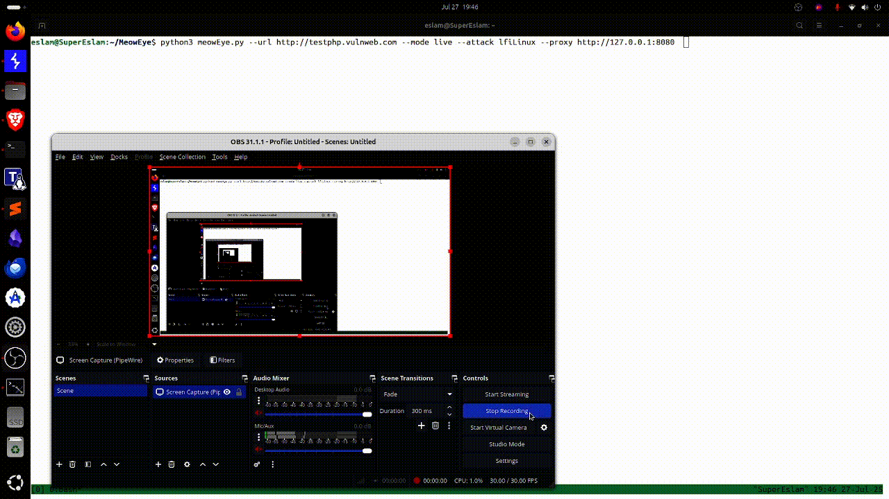

# 🐾 MeowEye

**MeowEye** is a real-life scanner for multiple web vulnerabilities. It uses a real browser to observe traffic and perform injection-based tests to detect reflective parameters, local file inclusion (LFI), and server-side template injection (SSTI) vulnerabilities for now. In the ToDo list it will include multiple vulnerabilities.


## 🐾 Why MeowEye?

I have a cat called **Koko** — she's absolutely gorgeous, but let’s be honest… she does *nothing* all day except meow, hiss, eat, sleep, and, well… 💩.

But her **eyes**? They catch everything.  
Her **ears**? Better than military-grade radar.  
Her **flexibility**? Makes me feel like I’m 80 years old.

So I built **MeowEye**, hoping it could be *just 1%* as elegant, alert, and (let’s face it) smarter than her.  
If it works… I’ll be happy. Don’t worry 😸

---
## 🚀 How It Works

The idea is super simple:

1. Run the command with your preferred configurations.
2. The tool opens a new Chromium tab.
3. You navigate through the app like a normal user, clicking and using functions as usual.

Meanwhile, the tool quietly captures every request and appends payloads to **each parameter**—but don’t worry, it *appends* rather than replaces, so nothing gets lost because of the app’s quirks.

At the end, if any vulnerabilities are found, the tool generates a file with all the juicy details in Burp Suite format. You can then copy, paste, and double-check at your leisure.

Easy peasy, bug-squeasy! 🐞




---

## 🚀 Features

- ✅ Real browser request interception via Selenium Wire  
- 🕵️‍♂️ Detects:
  - Reflective parameter injection
  - Local File Inclusion (LFI) on Linux and Windows
  - Server-Side Template Injection (SSTI)
  - More vulnerabilities will be added soon... 
- 🧪 Live & delayed scanning modes  
- 💥 Payload-based fuzzing with scope filtering  
- 🧾 Output saved in Burp-style HTTP requests  
- 🎨 Color-coded console messages (info, warnings, errors, findings)

---

## 🛠️ Installation

1. Clone the repo:
   ```bash
   git clone https://github.com/eslam3kl/MeowEye.git
   cd MeowEye
   ```

2. Install requirements:
   ```bash
   pip install -r requirements.txt
   ```

3. Download and install ChromeDriver compatible with your Chrome version:  
   https://chromedriver.chromium.org/downloads


4. If you faced any error, please search for it. The tool depends on a lot of libraries and tools. 

---

## ⚙️ Usage

```bash
python meoweye.py --mode [live|delay] --attack [ref|lfiLinux|lfiWin|ssti] --url <target_url> [--proxy http://127.0.0.1:8080]
```

### Arguments

| Option     | Description                                      |
|------------|--------------------------------------------------|
| `--mode`   | `live` or `delay` scanning                      |
| `--attack` | `ref`, `lfiLinux`, `lfiWin`, or `ssti`          |
| `--url`    | The initial URL to open in the browser          |
| `--proxy`  | Optional HTTP proxy for traffic interception    |

---

## 🔍 Scanning Modes

- **Live Mode**: This mode will capture all the requests are in scope based on the URL you've passed to the tool, then it will append the payloads one by one in each parameter.  
- **Delay Mode**: Same like Live but instead of testing/replacing the payload while you're mapping the file, it waits you till finishing the mapping process, then you go to the terminal, write work **yalla** and it will start scanning all the captured requests. 

---

## 📂 Payloads

Payloads are stored in the `payloads/` directory:

- `lfi-unix-payloads.txt`
- `lfi-windows-payloads.txt`
- `ssti-payloads.txt`

Each line is injected into parameters to test for vulnerabilities.

---

## 📑 Output

- Results are saved in `DDMMYYYY-output.txt`
- Vulnerable requests are formatted like Burp Suite requests, take copy and paste to confirm the finding. 


Output sample: 
```
GET /showimage.php?file=.%2Fpictures%2F3.jpg..%2F..%2F..%2F..%2F..%2Fetc%2Fpasswd&size=160 HTTP/1.1
Host: testphp.vulnweb.com
Proxy-Connection: keep-alive
User-Agent: Mozilla/5.0 (X11; Linux x86_64) AppleWebKit/537.36 (KHTML, like Gecko) Chrome/138.0.0.0 Safari/537.36
Accept: image/avif,image/webp,image/apng,image/svg+xml,image/*,*/*;q=0.8
Referer: http://testphp.vulnweb.com/listproducts.php?artist=1
Accept-Encoding: gzip, deflate
Accept-Language: en-US,en;q=0.9
```
---

### 📝 TODO

- [ ] Integrate with AI engine to validate the results
- [ ] Add more findings  
- [ ] Implement multi-threading for faster scanning  
- [ ] Add an **All** option to check all findings together  

---

## ❗ Disclaimer

> This tool is for educational and authorized testing purposes only. The developer is not responsible for any misuse. You're swimming in your own responsibility :) 

---

## 🤝 Contributions

Pull requests, ideas, and feedback are welcome!

---

Made by [Eslam Akl](https://eslam3kl.gitbook.io) 

Thanks to my cat Koko and ChatGPT. 
